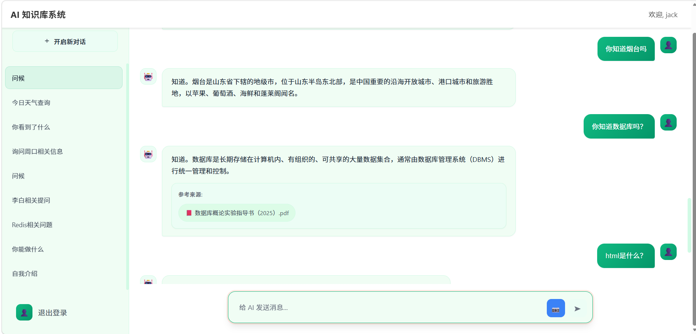
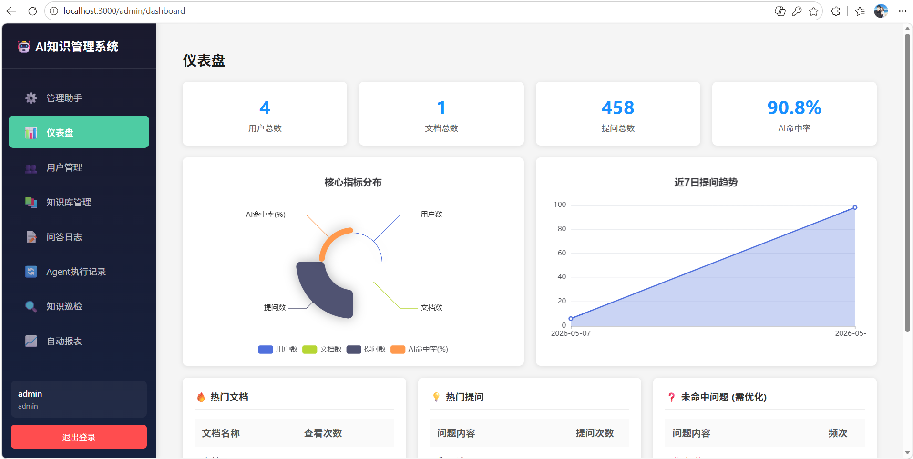
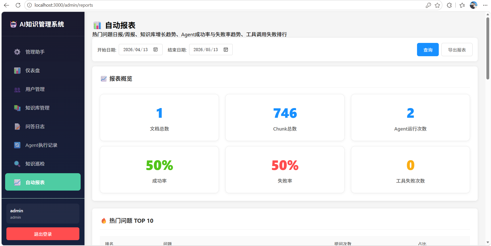

<div align="center">

# 🚀 AgentCraft — 多 Agent 协作智能知识库系统

**基于 Spring Boot + FastAPI + React 构建的 RAG 知识库问答平台，内置五层可编排 Agent 架构与多 Agent 协作机制，适合作为 Agent 后端开发学习项目与简历展示项目。**

[](https://openjdk.org/)
[](https://spring.io/projects/spring-boot)
[](https://python.org/)
[](https://fastapi.tiangolo.com/)
[](https://reactjs.org/)
[](https://milvus.io/)
[](https://redis.io/)
[](https://mysql.com/)
[](LICENSE)

</div>

---

## 📖 项目简介

AgentCraft 是一个"**前端 + Java 后端 + Python AI 微服务**"的**全栈 RAG 知识库系统**。核心亮点是 **五层可编排 Agent 架构**——Interface、Orchestrator、Tool、Memory、Evaluation 五层解耦，支持意图识别→问题改写→检索→充分性判断→答案生成的完整工作流。系统内置 Router Agent / Retrieval Agent / Ops Agent 多 Agent 协作，通过统一 Tool Registry 管理 AI 能力，支持 runId/traceId 全链路追踪。

**一句话总结**：不只是一个 RAG 问答系统，更是一个 Agent 架构学习项目。

---

## 🏗️ 系统架构

```
┌─────────────────────────────────────────────────────────────────┐
│                    React 前端 (用户端 + 管理端)                   │
│  用户端：智能对话、文档预览、历史管理                              │
│  管理端：仪表盘、知识库管理、Agent 执行记录、知识巡检、自动报表     │
└───────────────────────────┬─────────────────────────────────────┘
                            │ HTTP / SSE (JWT 认证)
                            ▼
┌─────────────────────────────────────────────────────────────────┐
│                   Spring Boot 后端 (API Gateway)                  │
│  用户认证 · 会话管理 · 多级缓存(Caffeine+Redis) · 文档管理         │
└───────────────────────────┬─────────────────────────────────────┘
                            │ REST API
                            ▼
┌─────────────────────────────────────────────────────────────────┐
│                Python AI 服务 (五层 Agent 架构)                    │
│                                                                 │
│  ┌───────────────────────────────────────────────────────────┐  │
│  │  Interface 层 — FastAPI 路由，HTTP/SSE 接口               │  │
│  └────────────────────────┬──────────────────────────────────┘  │
│  ┌────────────────────────▼──────────────────────────────────┐  │
│  │  Orchestrator 层 — Planner 规划 + Executor 执行 + State   │  │
│  └────────────────────────┬──────────────────────────────────┘  │
│  ┌────────────────────────▼──────────────────────────────────┐  │
│  │  Tool 层 — ToolRegistry 统一注册/调用/超时/重试            │  │
│  │  knowledge_search · question_rewrite · rerank · citation   │  │
│  │  memory_read · memory_write · ocr_extract · doc_summary    │  │
│  └────────────────────────┬──────────────────────────────────┘  │
│  ┌────────────────────────▼──────────────────────────────────┐  │
│  │  Memory 层 — Redis 短期 + MongoDB 会话 + MySQL 持久化      │  │
│  └────────────────────────────────────────────────────────────┘  │
│  ┌────────────────────────────────────────────────────────────┐  │
│  │  Evaluation 层 — 检索充分性判断 + 结果质量评估              │  │
│  └────────────────────────────────────────────────────────────┘  │
└───────────────────────────┬─────────────────────────────────────┘
                            │
              ┌─────────────┼─────────────┐
              ▼             ▼             ▼
        ┌──────────┐  ┌──────────┐  ┌──────────┐
        │  MySQL   │  │  Redis   │  │  Milvus  │
        │ 业务数据  │  │ 缓存/锁  │  │ 向量索引  │
        └──────────┘  └──────────┘  └──────────┘
```

---

## ✨ 核心亮点

### 亮点一：五层可编排 Agent 架构

将 AI 服务拆分为 Interface → Orchestrator → Tool → Memory → Evaluation 五层，每层职责单一、可独立扩展。

**单 Agent 端到端执行流程：**

```
用户提问
  │
  ▼
┌─────────────────┐
│ 意图识别         │  ← Planner.recognize_intent()
│ (Intent Recognition) │    判断：知识问答 / 闲聊 / 管理操作
└────────┬────────┘
         │
         ▼
┌─────────────────┐
│ 问题改写         │  ← Planner.rewrite_question()
│ (Query Rewrite)  │    补充上下文、消除歧义
└────────┬────────┘
         │
         ▼
┌─────────────────┐
│ 知识检索         │  ← VectorStore.search()
│ (Knowledge Search) │    Milvus 向量相似度搜索
└────────┬────────┘
         │
         ▼
┌─────────────────┐     不充分 → 追问用户
│ 充分性判断       │  ──────────────────────→
│ (Sufficiency)    │
└────────┬────────┘  充分
         │
         ▼
┌─────────────────┐
│ 答案生成         │  ← LLM.generate()
│ (Answer Generate) │    带引用来源的结构化回答
└────────┬────────┘
         │
         ▼
┌─────────────────┐
│ 记忆写入         │  ← MemoryWriteTool
│ (Memory Write)   │    保存对话上下文
└─────────────────┘
```

**关键代码：**
- `agent/orchestrator.py` — 编排器，创建 state、调用 planner、逐步执行
- `agent/planner.py` — 规划器，意图识别 + 问题分类 + 充分性判断
- `agent/executor.py` — 执行器，根据 step_type 分发到具体实现
- `agent/state.py` — 状态管理，run_id / trace_id / step 追踪

---

### 亮点二：多 Agent 协作机制

Router Agent 负责任务分发，Retrieval Agent 专精检索，Ops Agent 负责运营分析，各 Agent 独立可扩展。

**多 Agent 协作流程：**

```
用户提问
  │
  ▼
┌─────────────────┐
│  Router Agent    │  ← router_agent.py
│  任务类型识别     │    关键词权重 + LLM 分类
└───┬───┬───┬───┬─┘
    │   │   │   │
    ▼   │   │   │  闲聊
┌──────┐│   │   │
│ChitChat│  │   │  ← chitchat_agent.py
│Agent  ││   │    轻量级回复，不走检索
└──────┘│   │
        ▼   │  知识问答
   ┌────────────┐
   │ Retrieval  │  ← retrieval_agent.py
   │ Agent      │    Query Rewrite → Recall → Rerank → Citation
   └────────────┘
            │
            ▼  管理助手
       ┌──────────┐
       │Ops Agent │  ← ops_agent.py
       │          │    知识缺口/问答趋势/用户活跃度分析
       └──────────┘
```

**Retrieval Agent 内部链路：**

```
Query Rewrite → Knowledge Search → Rerank → Citation Integration → 答案生成
     ↑                ↑               ↑            ↑
  问题改写优化     Milvus 向量检索    语义重排序     引用来源整合
```

**关键代码：**
- `workflows/router_agent.py` — 4 种任务路由（闲聊/知识问答/管理助手/巡检）
- `workflows/retrieval_agent.py` — 完整检索链路，可配置开关
- `workflows/ops_agent.py` — 运营分析，直接查 MySQL，不走 LLM

---

### 亮点三：统一 Tool Registry 工具体系

将知识检索、OCR、文档摘要、对话记忆等 AI 能力抽象为标准 Tool，定义输入/输出 Schema、超时、重试与权限元数据。

```python
# tools/base.py — 工具基类
class Tool(ABC):
    name: str
    input_schema: ToolSchema      # 输入参数 Schema
    output_schema: ToolSchema     # 输出结果 Schema
    metadata: ToolMetadata        # 超时/重试/权限

    @abstractmethod
    def execute(self, parameters: Dict) -> Dict:
        pass

# tools/registry.py — 工具注册器（单例）
class ToolRegistry:
    def register_tool(tool: Tool)      # 注册工具
    def invoke_tool(name, params)       # 调用（带超时+重试）
    def get_all_tools() -> Dict         # 列出所有工具
```

**已注册工具列表：**

| 工具名 | 功能 | 超时 | 重试 |
|--------|------|------|------|
| knowledge_search | 知识库语义检索 | 30s | 3 |
| question_rewrite | 问题改写优化 | 30s | 3 |
| rerank | 语义重排序 | 30s | 3 |
| citation | 引用来源整合 | 5s | 1 |
| conversation_memory_read | 对话记忆读取 | 5s | 1 |
| conversation_memory_write | 对话记忆写入 | 5s | 1 |
| ocr_extract | OCR 文字提取 | 30s | 3 |
| doc_summary | 文档摘要生成 | 30s | 3 |

---

### 亮点四：全链路可观测

每个 Agent 运行都有 runId + traceId，支持执行记录查询、步骤追踪、工具调用审计。

```
run_id: "test-run-001"
  ├─ step 1: intent_recognition     → ✅ confidence: 0.95
  ├─ step 2: question_rewrite       → ✅ "什么是数据库" → "请解释数据库的定义、分类和常见应用场景"
  ├─ step 3: knowledge_search       → ✅ 返回 3 个相关 chunk
  ├─ step 4: result_evaluation      → ✅ 充分性: sufficient
  └─ step 5: answer_generation      → ✅ 生成答案 + 2 个引用来源
```

---

## 🛠️ 技术栈

### 后端

| 技术 | 版本 | 用途 |
|------|------|------|
| Java | 17 | 开发语言 |
| Spring Boot | 3.2.3 | 后端主框架 |
| MyBatis-Plus | 3.5.x | ORM 持久层 |
| MySQL | 8.0 | 关系型数据库 |
| Redis | 7.0 | 分布式缓存、会话管理 |
| Caffeine | 3.x | 本地缓存，毫秒级响应 |
| Spring Security | 6.2.x | JWT 认证 + 权限控制 |
| Spring WebFlux | - | SSE 流式响应 |
| 七牛云 Kodo | - | 文档对象存储 |

### AI 服务

| 技术 | 版本 | 用途 |
|------|------|------|
| Python | 3.9+ | AI 服务语言 |
| FastAPI | 0.110+ | 高性能 Web 框架 |
| LangChain | 0.1.x | RAG 流程管理 |
| Milvus | 2.4+ | 向量数据库，语义检索 |
| 通义千问 | qwen-plus | 大语言模型 |
| DashScope | - | Embeddings 向量化服务 |

### 前端

| 技术 | 版本 | 用途 |
|------|------|------|
| React | 18.2 | 前端主框架 |
| Vite | 5.x | 构建工具 |
| ECharts | 6.x | 数据可视化 |
| Axios | 1.x | HTTP 客户端 |

---

## 📸 效果展示

### 用户端

| 智能问答（带参考来源） | 闲聊路由（Router Agent 自动识别） |
|:---:|:---:|
|  |  |

### 管理端

| 仪表盘 | Agent 执行记录 |
|:---:|:---:|
|  |  |

| 知识巡检（Ops Agent） | 自动报表 |
|:---:|:---:|
|  |  |

---

## 🚀 快速启动

### 环境要求

- JDK 17+
- Python 3.9+
- Node.js 18+
- MySQL 8.0+
- Redis 7.0+
- Milvus 2.4+（可选，也支持 FAISS 本地模式）

### 1. 数据库准备

```bash
mysql -u root -p -e "CREATE DATABASE ai_knowledge_db CHARACTER SET utf8mb4 COLLATE utf8mb4_unicode_ci;"
mysql -u root -p ai_knowledge_db < sql/init.sql
```

### 2. Java 后端启动

```bash
# 编辑 src/main/resources/application.yml 配置 MySQL / Redis 连接
mvn clean package
java -jar target/ai-knowledge-system-*.jar
# 默认端口 8080
```

### 3. Python AI 服务启动

```bash
cd python-service
pip install -r requirements.txt
# 配置 .env（MILVUS_HOST、DASHSCOPE_API_KEY 等）
python main.py
# 默认端口 8000
```

### 4. 前端启动

```bash
cd frontend
npm install
npm run dev
# 默认端口 3000
```

### 默认账号

- 用户端：手机验证码注册登录（未配置短信时为模拟模式）
- 管理端：`admin` / `admin123`

---

## 📝 简历写法参考

> 以下话术可直接用于简历项目经历描述，面试时围绕每条展开讲解即可。

**1. 负责五层可编排 Agent 架构设计与实现**，将 AI 服务拆分为 Interface、Orchestrator、Tool、Memory、Evaluation 五层，实现意图识别→问题改写→检索→充分性判断→答案生成的完整工作流；通过 StepType 枚举 + Planner 动态规划步骤，支持任务编排与独立扩展，runId/traceId 实现全链路追踪。

**2. 设计并实现多 Agent 协作机制**，Router Agent 基于关键词权重算法识别任务类型并分发至对应 Agent，Retrieval Agent 专精 Query Rewrite + 多路召回 + Rerank + Citation 全链路检索，Ops Agent 负责知识缺口分析与运营报告生成；各 Agent 独立可扩展，共享状态协同工作。

**3. 构建统一 Tool Registry 工具体系**，将知识检索、OCR、文档摘要、对话记忆等 AI 能力抽象为标准 Tool，定义输入/输出 Schema、超时、重试与权限元数据；通过单例 ToolRegistry 实现工具注册/查找/调用，支持单工具执行与多工具链编排，基于 ThreadPoolExecutor 实现超时控制。

**4. 设计并实现多级缓存架构**，Caffeine 本地缓存 + Redis 分布式缓存两级架构，实现缓存穿透/雪崩防护机制，热点数据毫秒级响应；通过 @Async 异步处理提升系统吞吐量。

**5. 实现 RAG 全链路知识库系统**，支持多格式文档（PDF/Word/TXT）自动解析、向量化存储至 Milvus，用户提问时通过语义检索 + Rerank 重排序精准召回相关文档，生成带引用来源的结构化答案，支持在线预览/下载。

---

## 🗺️ 迭代路线图

| 阶段 | 内容 | 状态 |
|------|------|------|
| Phase 1 | RAG 知识库核心链路（上传→解析→向量化→检索→生成） | ✅ 已完成 |
| Phase 2 | 多级缓存 + 对话上下文 + SSE 流式输出 | ✅ 已完成 |
| Phase 3 | 五层 Agent 架构 + 全链路追踪 | ✅ 已完成 |
| Phase 4 | 多 Agent 协作（Router + Retrieval + Ops） | ✅ 已完成 |
| Phase 5 | Docker Compose 一键部署 | 📋 计划中 |
| Phase 6 | 接入更多 LLM（OpenAI / Claude / 本地模型） | 📋 计划中 |
| Phase 7 | Reasoning Agent（归纳推理独立 Agent） | 📋 计划中 |
| Phase 8 | Memory Agent（记忆压缩 + 主动读写） | 📋 计划中 |

---

## 🎓 学完这个项目你能掌握什么

| 能力 | 对应代码 | 面试考点 |
|------|---------|---------|
| RAG 全链路设计 | python-service/core/ + tools/ | 向量检索、Embedding、Rerank |
| Agent 架构设计 | python-service/agent/ | 编排器、规划器、执行器、状态机 |
| 多 Agent 协作 | python-service/workflows/ | Router 分发、Agent 间通信 |
| 工具注册体系 | python-service/tools/registry.py | 插件化设计、Schema 校验、超时重试 |
| 多级缓存 | src/.../service/impl/CacheService | Caffeine + Redis、穿透/雪崩防护 |
| SSE 流式输出 | src/.../controller/ChatController | WebFlux Flux、Server-Sent Events |
| JWT 认证 | src/.../config/SecurityConfig | Token 生成/校验/刷新 |
| 向量数据库 | python-service/core/vector_store.py | Milvus 部署、索引、检索、删除 |

---

## ⚠️ 已知问题与改进方向

### 当前存在的问题

1. **Reasoning Agent 缺失**：答案生成目前由 KnowledgeQAAgent 直接调用 LLM，没有独立的归纳推理 Agent，复杂问题的推理能力有限。
2. **Memory Agent 缺失**：记忆管理目前是 memory_read/write 工具的被动调用，没有独立的记忆压缩 Agent，长对话场景下记忆效率会下降。
3. **四级记忆体系不完整**：短期记忆（Redis）和会话记忆（MongoDB）已实现，但知识分层记忆和用户个性化记忆尚未实现。
4. **Rerank 默认关闭**：Retrieval Agent 中 `use_rerank` 和 `use_rewrite` 默认为 False，需要手动开启，且依赖 cohere API。
5. **无 Docker Compose**：目前需要分别启动 Java / Python / 前端三个服务，缺少一键部署方案。
6. **前端无 TypeScript**：前端使用纯 JavaScript，没有类型检查，对于大型项目可维护性不足。
7. **短信验证码为模拟模式**：未配置阿里云短信时，验证码直接输出到控制台，不适合生产环境。
8. **七牛云为必需依赖**：文档上传功能强依赖七牛云 Kodo，本地开发需要配置或改造为本地存储。

### 改进方向

- 补充 Reasoning Agent 和 Memory Agent，完善五层架构
- 提供 Docker Compose 一键部署方案
- 接入更多 LLM 提供商（OpenAI / Claude / 本地 Ollama）
- 前端迁移到 TypeScript + 状态管理库
- 添加单元测试和 CI/CD 流水线

---

## 📄 开源协议

[MIT License](LICENSE) — 可自由用于学习、毕设、简历项目。
