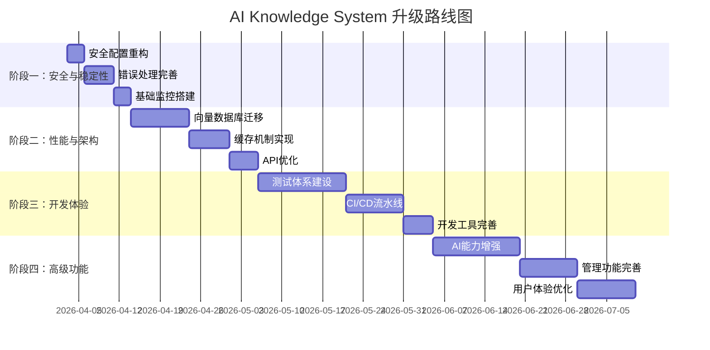

# AI Knowledge System 升级计划

> **版本**: 1.0  
> **创建日期**: 2026-04-02  
> **最后更新**: 2026-04-02  
> **负责人**: 项目团队

## 📋 目录

- [项目现状分析](#项目现状分析)
- [升级路线图](#升级路线图)
- [阶段一：安全与稳定性加固](#阶段一安全与稳定性加固)
- [阶段二：性能与架构优化](#阶段二性能与架构优化)
- [阶段三：开发体验提升](#阶段三开发体验提升)
- [阶段四：高级功能扩展](#阶段四高级功能扩展)
- [技术选型建议](#技术选型建议)
- [实施优先级矩阵](#实施优先级矩阵)
- [成功指标](#成功指标)
- [风险与应对](#风险与应对)
- [附录](#附录)

## 🏗️ 项目现状分析

### 技术栈概览

| 组件 | 技术栈 | 版本 | 状态 |
|------|--------|------|------|
| **后端** | Spring Boot + MyBatis-Plus | 3.2.3 | ✅ 稳定 |
| **数据库** | MySQL + Redis | - | ✅ 稳定 |
| **AI服务** | FastAPI + LangChain | - | ⚠️ 需优化 |
| **向量库** | FAISS (本地) | 1.8.0 | ❌ 需替换 |
| **前端** | React 18 + Vite | 18.2.0 | ✅ 稳定 |
| **存储** | 七牛云Kodo | - | ✅ 稳定 |
| **认证** | JWT + Spring Security | - | ⚠️ 需加固 |

### 当前问题诊断

#### 🔴 高优先级问题（立即修复）

1. **安全性风险**
   - JWT密钥硬编码 (`your-secret-key-change-in-production`)
   - 数据库密码使用默认值
   - 七牛云AK/SK配置暴露风险
   - **文件**: `src/main/resources/application.yml:11,64`

2. **向量数据库限制**
   - FAISS不支持高效删除操作
   - 本地存储无法分布式部署
   - 删除逻辑不彻底
   - **文件**: `python-service/core/vector_store.py:73-98`

3. **配置硬编码**
   - 文件上传路径: `D:/aiknowledge/uploads` (Windows依赖)
   - AI服务URL硬编码
   - **文件**: `src/main/resources/application.yml:69`

#### 🟡 中优先级问题（1个月内修复）

4. **错误处理不完善**
   - Python服务缺少全局异常处理
   - 缺少重试机制和降级策略
   - 日志记录不完整

5. **性能优化缺失**
   - 无缓存机制 (Redis未充分利用)
   - 频繁查询无优化
   - 前端缺少代码分割

6. **监控可观测性不足**
   - 只有基础健康检查
   - 缺少业务指标监控
   - 无链路追踪

7. **API文档缺失**
   - 缺少Swagger/OpenAPI文档
   - 接口测试用例不足

#### 🟢 低优先级问题（长期优化）

8. **测试覆盖不足**
   - 单元测试几乎为零
   - 集成测试缺失
   - 前端测试未建立

9. **部署方案不完善**
   - 缺少Docker容器化
   - 无CI/CD流水线
   - 环境配置管理混乱

10. **代码质量待提升**
    - 部分业务逻辑耦合度高
    - 缺少设计模式应用
    - 代码注释不足

## 🗺️ 升级路线图

### 总体时间规划



### 阶段一：安全与稳定性加固（1-2周）

**目标**: 消除安全风险，确保生产环境稳定

#### 任务清单

1. **安全配置重构** (3天)
   - 迁移所有敏感配置到环境变量
   - 创建环境变量模板文件
   - 添加配置验证机制

2. **错误处理完善** (5天)
   - 添加全局异常处理器
   - 实现重试和降级策略
   - 完善日志系统 (结构化日志)

3. **基础监控搭建** (3天)
   - 添加Prometheus指标
   - 实现基础告警
   - 完善健康检查端点

#### 交付物
- `.env.template` 环境变量模板
- 统一异常处理框架
- 监控仪表板基础版

### 阶段二：性能与架构优化（2-4周）

**目标**: 提升系统性能，优化架构设计

#### 任务清单

1. **向量数据库迁移** (10天)
   - 评估 Milvus vs Chroma vs Pinecone
   - 实现平滑迁移方案
   - 添加向量库监控

2. **缓存机制实现** (7天)
   - Redis缓存热点数据
   - 实现缓存失效策略
   - 添加缓存监控

3. **API优化** (5天)
   - 添加Swagger文档
   - 实现API版本管理
   - 优化接口性能

#### 交付物
- 生产级向量数据库
- 多级缓存系统
- 完整的API文档

### 阶段三：开发体验提升（3-5周）

**目标**: 提升开发效率，完善工具链

#### 任务清单

1. **测试体系建设** (15天)
   - 添加单元测试 (覆盖率>70%)
   - 实现集成测试
   - 添加前端测试

2. **CI/CD流水线** (10天)
   - Docker容器化部署
   - GitHub Actions流水线
   - 自动化测试部署

3. **开发工具完善** (5天)
   - 代码规范检查
   - 自动化文档生成
   - 本地开发环境优化

#### 交付物
- 完整的测试套件
- 自动化部署流水线
- 开发工具链

### 阶段四：高级功能扩展（1-2个月）

**目标**: 增强产品竞争力，扩展业务场景

#### 任务清单

1. **AI能力增强** (15天)
   - 支持多模型切换
   - 实现流式响应
   - 添加对话记忆

2. **管理功能完善** (10天)
   - 数据分析和报表
   - 用户行为分析
   - 系统配置管理

3. **用户体验优化** (10天)
   - 响应式设计优化
   - 国际化支持
   - 无障碍访问

#### 交付物
- 增强的AI能力
- 完善的管理后台
- 优化的用户体验

## 🔧 技术选型建议

### 向量数据库迁移方案

| 选项 | 优点 | 缺点 | 推荐度 | 适用场景 |
|------|------|------|--------|----------|
| **Milvus** | 生产级、高性能、支持过滤、社区活跃 | 部署复杂、资源消耗大 | ★★★★☆ | 生产环境、大规模数据 |
| **Chroma** | 轻量级、易部署、Python原生、开源 | 功能相对简单、性能一般 | ★★★☆☆ | 开发环境、中小规模 |
| **Pinecone** | 全托管、易用性高、无需运维 | 成本较高、厂商锁定 | ★★☆☆☆ | 快速原型、预算充足 |

**建议**: 从FAISS迁移到 **Milvus**，保留FAISS作为开发环境fallback。

### 缓存策略设计

```yaml
# 缓存层级设计
缓存层级:
  1. 本地缓存: Caffeine (高频访问，毫秒级响应)
  2. Redis缓存: 分布式缓存 (秒级响应)
  3. 数据库: 持久化存储

# 缓存策略
缓存策略:
  - 问答结果: TTL=1小时，最大条目=10000
  - 用户会话: TTL=24小时，最大条目=5000
  - 文档元数据: TTL=5分钟，最大条目=1000
  - 向量索引: 不缓存，实时查询
```

### 监控体系架构

```
监控体系:
  ├── 应用监控 (Spring Boot Actuator)
  │   ├── JVM指标 (内存、GC、线程)
  │   ├── HTTP指标 (请求量、延迟、错误率)
  │   └── 数据库指标 (连接池、查询性能)
  │
  ├── 业务监控 (自定义指标)
  │   ├── 用户指标 (活跃用户、注册率)
  │   ├── 问答指标 (问答量、命中率、满意度)
  │   └── 文档指标 (上传量、解析成功率)
  │
  ├── AI服务监控
  │   ├── 模型指标 (响应时间、token消耗)
  │   ├── 向量库指标 (查询延迟、索引大小)
  │   └── 外部API指标 (调用成功率、延迟)
  │
  └── 基础设施监控
      ├── 服务器指标 (CPU、内存、磁盘、网络)
      ├── 容器指标 (Docker/K8s)
      └── 网络指标 (带宽、延迟、错误率)
```

## 📊 实施优先级矩阵

| 优先级 | 功能模块 | 预计工时 | 业务价值 | 技术风险 | 依赖项 |
|--------|----------|----------|----------|----------|--------|
| **P0** | 安全配置修复 | 3天 | 高 | 低 | 无 |
| **P0** | 错误处理完善 | 5天 | 高 | 中 | 安全配置 |
| **P1** | 向量数据库迁移 | 10天 | 高 | 高 | 错误处理 |
| **P1** | 缓存机制实现 | 7天 | 高 | 中 | 向量数据库 |
| **P2** | 测试体系建设 | 15天 | 中 | 低 | 缓存机制 |
| **P2** | CI/CD流水线 | 10天 | 中 | 中 | 测试体系 |
| **P3** | 监控系统完善 | 8天 | 中 | 低 | CI/CD |
| **P3** | API文档生成 | 3天 | 低 | 低 | 监控系统 |

## 🎯 成功指标

### 技术指标

| 指标 | 目标值 | 测量方法 |
|------|--------|----------|
| 安全性 | 零高危漏洞 | 安全扫描工具 |
| 性能 (P95) | < 2秒 | 性能测试工具 |
| 可用性 (SLA) | 99.9% | 监控系统 |
| 测试覆盖率 | > 70% | 测试报告 |
| 部署频率 | 每天多次 | CI/CD流水线 |
| 恢复时间 | < 15分钟 | 故障演练 |

### 业务指标

| 指标 | 目标值 | 测量方法 |
|------|--------|----------|
| 用户满意度 | > 4.5/5 | 用户反馈 |
| 问答准确率 | > 85% | 人工评估 |
| 系统吞吐量 | 1000+ 并发 | 压力测试 |
| 文档处理速度 | < 30秒/文档 | 性能监控 |
| 用户留存率 | > 60% (7天) | 数据分析 |

## ⚠️ 风险与应对

| 风险 | 概率 | 影响 | 应对措施 | 负责人 |
|------|------|------|----------|--------|
| 数据迁移失败 | 中 | 高 | 完整备份，分阶段迁移，回滚方案 | 后端团队 |
| 性能下降 | 低 | 中 | 性能测试，灰度发布，监控告警 | 性能团队 |
| 兼容性问题 | 中 | 中 | 版本兼容性测试，API版本管理 | 测试团队 |
| 团队技能不足 | 低 | 高 | 培训文档，外部支持，知识分享 | 技术总监 |
| 时间延误 | 中 | 中 | 敏捷开发，定期评审，风险预警 | 项目经理 |
| 预算超支 | 低 | 高 | 成本监控，优先级调整，资源优化 | 财务总监 |

## 📝 附录

### A. 环境变量配置模板

```bash
# .env.template
# 数据库配置
DB_HOST=localhost
DB_PORT=3306
DB_NAME=ai_knowledge_db
DB_USER=root
DB_PASSWORD=CHANGE_ME

# Redis配置
REDIS_HOST=localhost
REDIS_PORT=6379
REDIS_PASSWORD=

# JWT配置
JWT_SECRET=your-secure-random-key-change-this
JWT_EXPIRATION=3600000
JWT_REFRESH_EXPIRATION=86400000

# 七牛云配置
QINIU_ACCESS_KEY=your-access-key
QINIU_SECRET_KEY=your-secret-key
QINIU_BUCKET=your-bucket-name
QINIU_DOMAIN=your-domain.com

# AI服务配置
AI_SERVICE_URL=http://localhost:8000/api
DASHSCOPE_API_KEY=your-dashscope-api-key

# 阿里云短信 (可选)
ALIYUN_SMS_ACCESS_KEY_ID=your-access-key-id
ALIYUN_SMS_ACCESS_KEY_SECRET=your-access-key-secret
ALIYUN_SMS_SIGN_NAME=your-sign-name
ALIYUN_SMS_TEMPLATE_CODE=your-template-code

# 上传配置
UPLOAD_DIR=./uploads
MAX_FILE_SIZE=52428800  # 50MB
```

### B. 立即行动项检查清单

- [x] 创建 `.env.template` 文件
- [x] 修改 `application.yml` 使用环境变量
- [ ] 添加 Spring Boot Actuator 依赖
- [ ] 配置 Prometheus 监控
- [ ] 创建全局异常处理器
- [ ] 添加结构化日志
- [ ] 设置代码规范检查
- [ ] 创建项目文档目录

### C. 相关文档链接

1. [项目README](./README.md)
2. [数据库设计文档](./sql/README.md)
3. [API接口文档](./docs/api.md) (待创建)
4. [部署指南](./docs/deployment.md) (待创建)
5. [开发规范](./docs/development.md) (待创建)

### D. 联系方式

- **项目负责人**: [待指定]
- **技术负责人**: [待指定]
- **产品负责人**: [待指定]
- **运维负责人**: [待指定]

---

**文档状态**: 草案  
**下次评审日期**: 2026-04-09  
**更新记录**:
- 2026-04-02: 创建初始版本

> **注意**: 本计划为动态文档，将根据项目进展定期更新。所有团队成员应定期查阅最新版本。